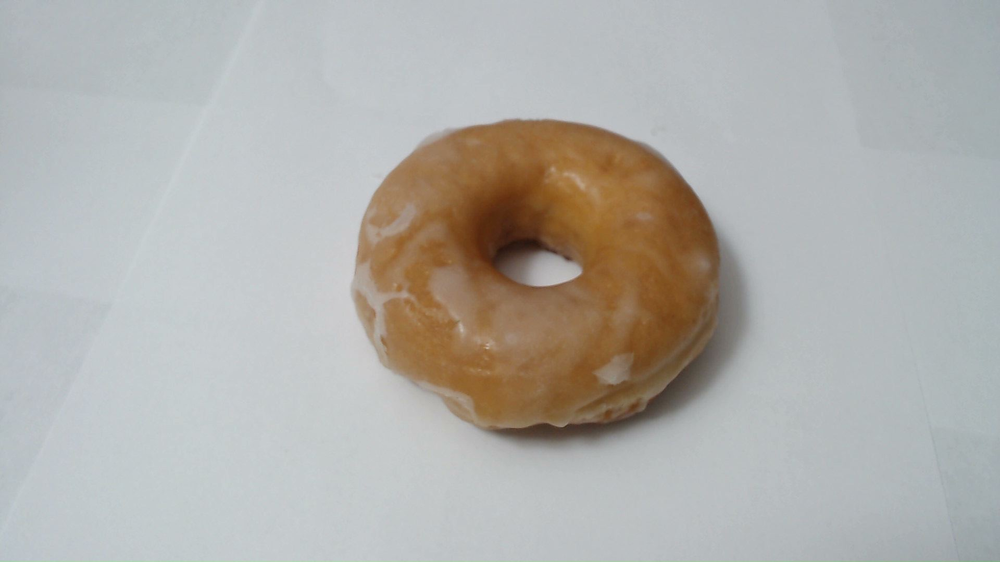
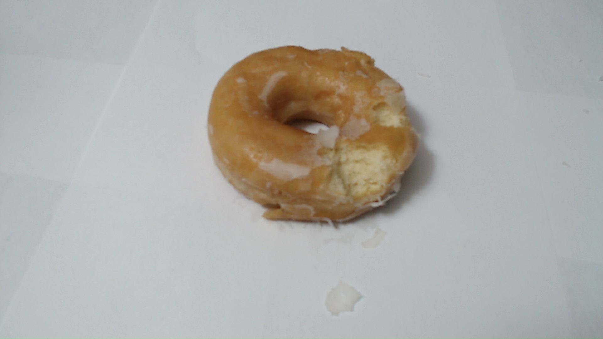
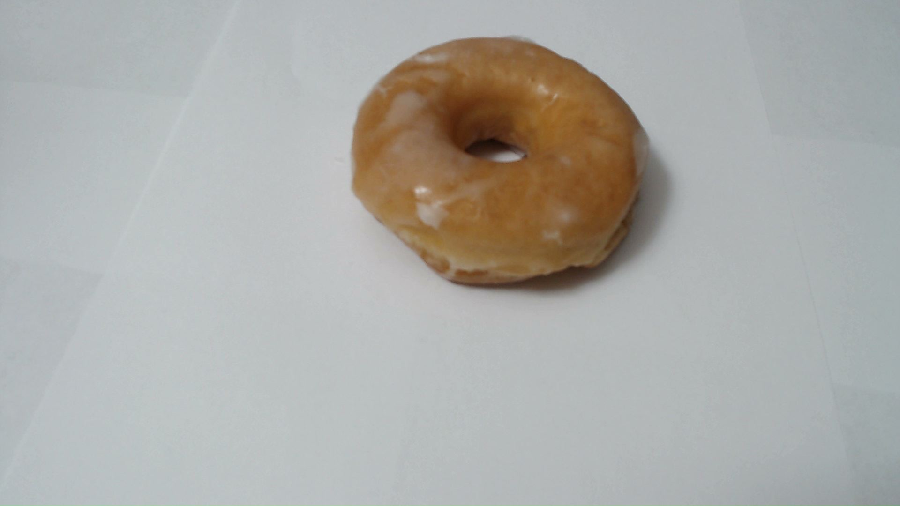

# Donut - CPU

- OK



```
python3 classify_image_non_edge.py --model models/donut.tflite --label models/donut_labels.txt --input images/donut1.png
```

* Not OK *



```
python3 classify_image_non_edge.py --model models/donut.tflite --label models/donut_labels.txt --input images/donut4.png
```

# Donut - Edge



```
python3 classify_image.py --model models/donut_edge_tpu.tflite --label models/donut_labels.txt --input images/donut2.png
```


```
python3 classify_image.py --model models/donut_edge_tpu.tflite --label models/donut_labels.txt --input images/donut6.png
```