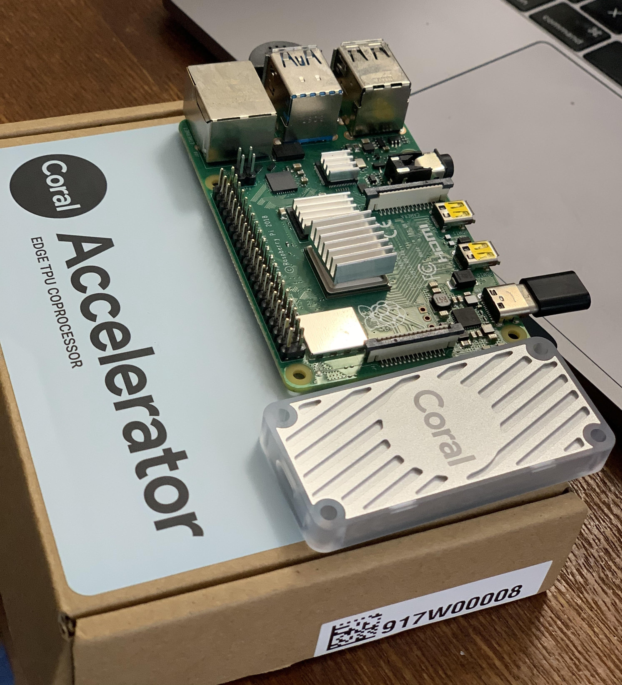

# Cloud Edge TPU Demo

## Overview

This repository contains the sample script to run the image classification and object detection using Google USB Coral Accelerator Edge TPU in RaspberryPi 4.

<p>
    
</p>

## Demo

### Boat Classification

<p align="center">
  
</p>

The different boat images are uploaded into Google's AutoML Vision portal and tagged into five different categories

* Sail Boat
* Kayak
* Ferry
* Cruise
* Gondola

#### Example images
<p>
  
  
  
  
</p>


Once the models are trained, the trained models are exported into both TFLite ML model and TFLite ML model optimized for Edge TPU.

Navigate to the classfication directory

```
cd classfication
```

CPU/GPU:

```bash
python3 classify_image_non_edge.py --model models/boat.tflite --label models/boat_labels.txt --input images/boat1.jpg
```

```
Initializing TF Lite interpreter...
INFO: Initialized TensorFlow Lite runtime.
----INFERENCE TIME----
111.8ms
110.0ms
107.0ms
112.0ms
110.8ms
-------RESULTS--------
b`kayak`: 0.7523
```

With Edge TPU - USB Accelerator

```bash
python3 classify_image.py --model models/boat_edge_tpu.tflite --label models/boat_labels.txt --input images/boat1.jpg
```

You should see results like this:

```.bash
Initializing TF Lite interpreter...
INFO: Initialized TensorFlow Lite runtime.
----INFERENCE TIME----
Note: The first inference on Edge TPU is slow because it includes loading the model into Edge TPU memory.
11.8ms
3.0ms
2.8ms
2.9ms
2.9ms
-------RESULTS--------
b`kayak`: 0.76562
```


## Object Detection

The object detection script runs the webcam from Raspberry Pi and run the object detection using the [CocoSSD MobileNet](https://storage.googleapis.com/download.tensorflow.org/models/tflite/coco_ssd_mobilenet_v1_1.0_quant_2018_06_29.zip)


```bash
# Navigate to the object detection directory
cd objectdetection

python3 detection_webcam.py --modeldir model
```

This wil open the webcam and detect the object with bounding boxes.

### Notes
* Connect through ethernet attached to pi
```
ssh pi@192.168.2.2 
```
